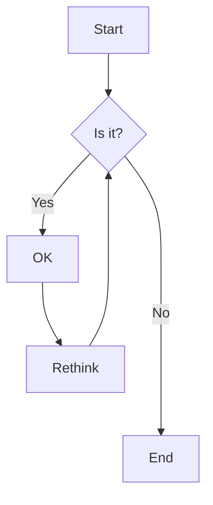
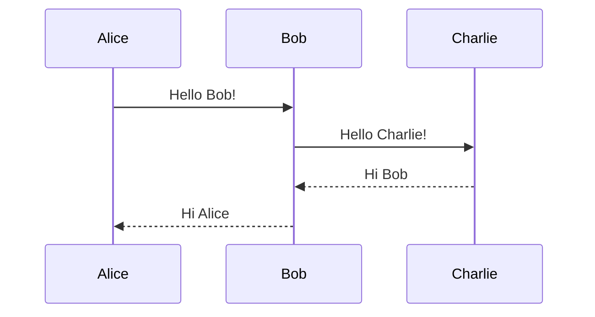
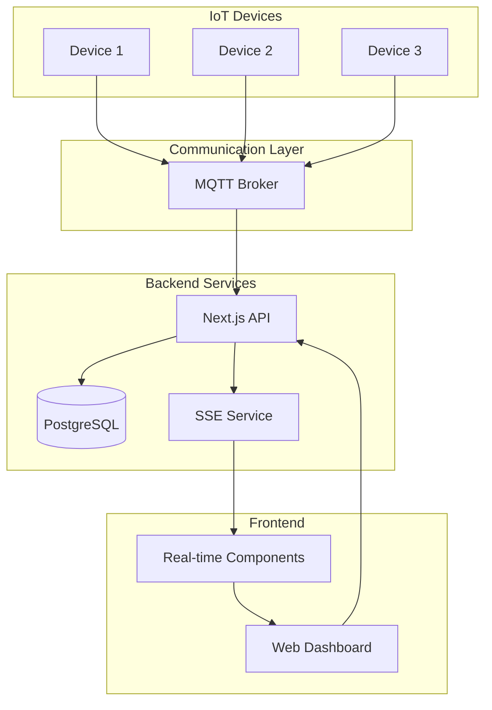
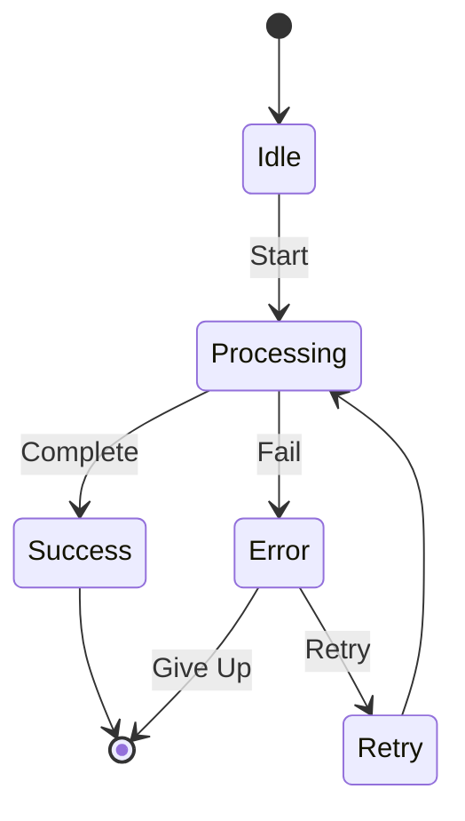

# Mermaid Diagram Test

This page tests the Mermaid diagram rendering functionality.

## Basic Flowchart



## Sequence Diagram



## IoT System Architecture



## State Diagram



## GitGraph

```mermaid
gitgraph
    commit id: "Initial"
    branch develop
    checkout develop
    commit id: "Feature A"
    commit id: "Feature B"
    checkout main
    merge develop
    commit id: "Release"
```
