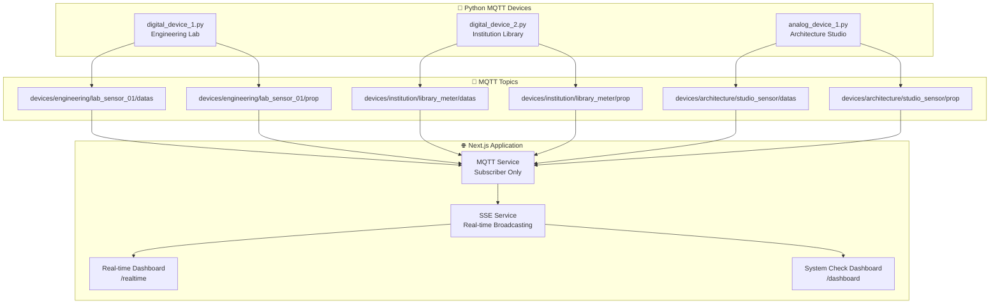

# 📚 Documentation Index - IoT Electric Energy Management System

> สารบัญเอกสารประกอบโปรเจค IoT Electric Energy Management System

## 📋 เอกสารหลัก

### 🏠 [README.md](../README.md)
เอกสารหลักของโปรเจค รวมถึง overview, features, installation guide และ architecture

### 🎯 [PROJECT_STATUS_2025.md](./PROJECT_STATUS_2025.md)
สถานะปัจจุบันของโปรเจค (สิงหาคม 2025) รวมถึง completed features, technical architecture และ deployment status

## 📡 MQTT & IoT Documentation

### 📊 [MQTT_TOPICS_GUIDE.md](./MQTT_TOPICS_GUIDE.md)
คู่มือการใช้งาน MQTT Topics โครงสร้างใหม่ (อัพเดท 2025):
- Topic structure: `devices/{faculty}/{device}/datas` และ `devices/{faculty}/{device}/prop`
- Faculty organization และ device examples
- Status logic (online/offline ตาม 60-second timeout)
- Testing commands และ dashboard integration

### 📋 [MQTT_DATA_FORMAT.md](./MQTT_DATA_FORMAT.md)
รูปแบบข้อมูลที่ส่งผ่าน MQTT:
- Device registration format
- Real-time energy data structure
- Environmental data (simplified to temperature only)
- Bulk data formats

### 🧪 [MQTT_TESTING_GUIDE.md](./MQTT_TESTING_GUIDE.md)
คู่มือการทดสอบ MQTT system:
- Python device simulators
- Manual testing procedures
- MQTT Explorer usage
- Troubleshooting common issues

## 🔐 Authentication & Security

### 🔑 [JWT-BEARER-GUIDE.md](./JWT-BEARER-GUIDE.md)
คู่มือการใช้งาน JWT Authentication:
- Token structure และ validation
- API endpoint authentication
- Role-based access control
- Security best practices

### 📄 [JWT-Bearer-Token-API.postman_collection.json](./JWT-Bearer-Token-API.postman_collection.json)
Postman collection สำหรับทดสอบ API authentication

## 🗄️ Database Documentation

### 💾 [DATABASE-COMMANDS.md](./DATABASE-COMMANDS.md)
คำสั่ง database ที่ใช้ในโปรเจค:
- PostgreSQL setup และ configuration
- Schema creation scripts
- Migration commands
- Maintenance procedures

### 🔧 [SCHEMA-SETUP-GUIDE.md](./SCHEMA-SETUP-GUIDE.md)
คู่มือการ setup database schema:
- Table structure
- Relationships และ foreign keys
- Indexes และ performance optimization
- Initial data seeding

### 📊 [IOT_DEVICES_TABLE.md](./IOT_DEVICES_TABLE.md)
โครงสร้าง table สำหรับ IoT devices:
- Device registration fields
- Status tracking
- Data relationships
- Query examples

## 🧪 Testing & API Documentation

### 📡 [POSTMAN-API-TESTING.md](./POSTMAN-API-TESTING.md)
คู่มือการทดสอบ API ด้วย Postman:
- API endpoint testing
- Authentication flows
- Error handling verification
- Performance testing

## 🏗️ Architecture Overview

### 📈 Current System Architecture (August 2025)



## 🔄 System Updates History

### August 2025 Updates
- ✅ **MQTT Topic Restructure**: Separated data and properties topics
- ✅ **Status Simplification**: Online/Offline only with timeout logic
- ✅ **Environmental Data Cleanup**: Temperature only
- ✅ **Python Device Simulators**: Complete testing environment
- ✅ **Dashboard Improvements**: Real-time monitoring and system diagnostics

### Previous Updates
- Authentication system with JWT
- PostgreSQL database integration
- SSE real-time communication
- Multi-faculty support
- Role-based access control

## 🚀 Quick Start Guide

### 1. Development Environment
```bash
# Install dependencies
npm install

# Setup environment
cp .env.example .env

# Start development server
npm run dev
```

### 2. Test MQTT System
```bash
# Start Python MQTT devices
cd mqtt_test_devices
python digital_device_1.py
python digital_device_2.py
python analog_device_1.py
```

### 3. Access Dashboards
- **Real-time Monitor**: http://localhost:3000/realtime
- **System Check**: http://localhost:3000/dashboard
- **Admin Panel**: http://localhost:3000/admin

## 📞 Support & Troubleshooting

### Common Issues
1. **MQTT Connection Failed**: Check broker settings in `.env`
2. **SSE Not Working**: Verify firewall and proxy settings
3. **Database Errors**: Check PostgreSQL connection and credentials
4. **Authentication Issues**: Verify JWT secret and cookie settings

### Getting Help
- Check the relevant documentation above
- Review error logs in browser console
- Test with Postman collection
- Verify Python device simulators are running

---

**Last Updated**: August 19, 2025  
**Documentation Version**: 2.0.0  
**Project Status**: Development Complete
